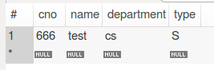
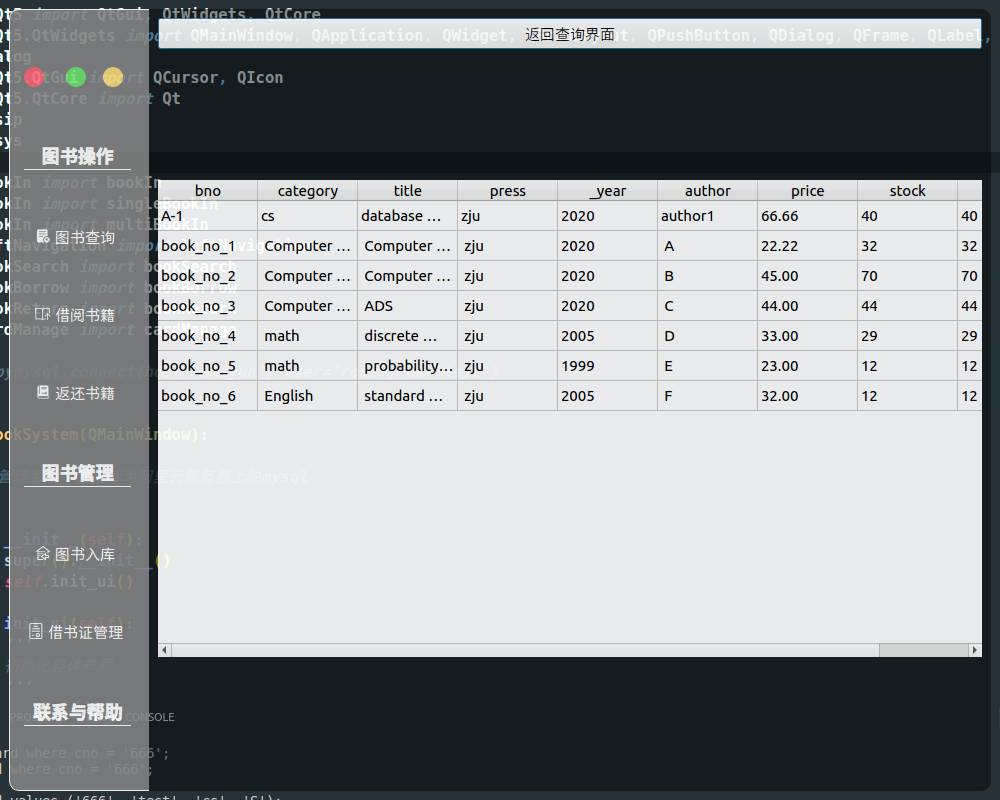
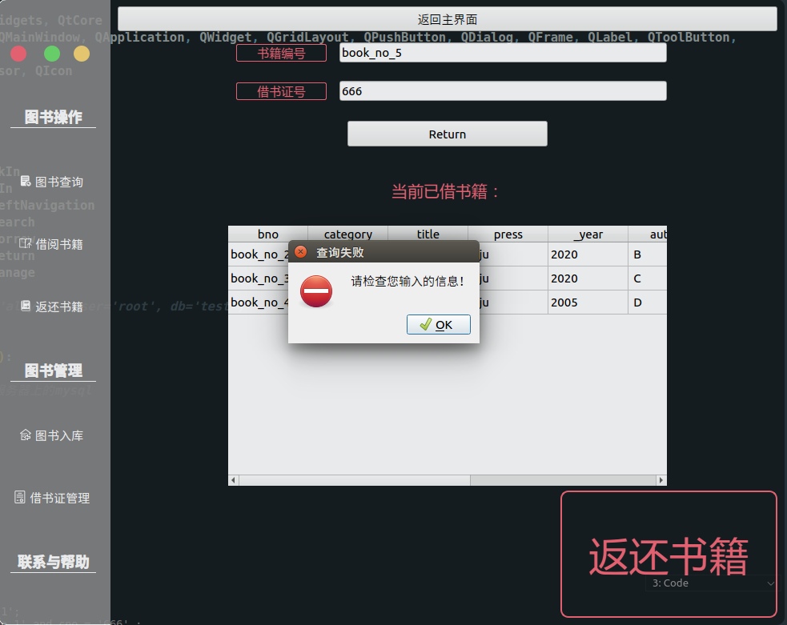

 

 

 

<h1>数据库系统实验报告</h1>

 

| 作业名称： | 图书管理系统 |
| :--------: | :----------: |
|  姓  名：  |     葛浩     |
|  学  号：  |     ***      |
| 电子邮箱： |     ***      |
| 联系电话： |     ***      |
| 指导老师： |     ***      |

 ps：为避免泄露个人信息，部分内容与原报告略有不同

 

 

<b>2020年 4月 10日</b>

### 一、实验目的

掌握数据库应用开发程序设计方法

### 二、系统需求

#### 基本要求

- 设计简单的图书管理数据库概念模式
- 设计相应的关系模式
- 基于ODBS或JDBC实现一个图书管理程序,实现图书、借书证及图书借阅的管理的基本功能

#### 设计要点

##### (1)基本数据对象

| 对象名称 | 包含属性                                                   |
| -------- | ---------------------------------------------------------- |
| 书       | 书号, 类别, 书名, 出版社, 年份, 作者, 价格, 总藏书量, 库存 |
| 借书证   | 卡号, 姓名, 单位, 类别 (教师 学生等)                       |
| 借书记录 | 卡号, 借书证号 ,借期, 还期                                 |

#####  (2)基本功能模块

|  模块名称  |                           功能描述                           |
| :--------: | :----------------------------------------------------------: |
|  图书入库  | 1. 单本入库2. 批量入库 (方便最后测试)图书信息存放在文件中, 每条图书信息为一行. 一行中的内容如下( 书号, 类别, 书名, 出版社, 年份, 作者, 价格, 数量 ) Note: 其中 年份、数量是整数类型； 价格是两位小数类型； 其余为字符串类型  Sample：(  book_no_1, Computer Science, Computer Architecture, xxx, 2004, xxx, 90.00, 2 ) |
|  图书查询  | 要求可以对书的 类别, 书名, 出版社, 年份(年份区间), 作者, 价格(区间) 进行查询. 每条图书信息包括以下内容:( 书号, 类别, 书名, 出版社, 年份, 作者, 价格, 总藏书量, 库存 ) |
|    借书    | 1.输入借书证卡号显示该借书证所有已借书籍 (返回, 格式同查询模块)2.输入书号    如果该书还有库存，则借书成功，同时库存数减一。否则输出该书无库存，且输出最近归还的时间。 |
|    还书    | 1.输入借书证卡号 显示该借书证所有已借书籍 (返回, 格式同查询模块)2.输入书号    如果该书在已借书籍列表内, 则还书成功, 同时库存加一.    否则输出出错信息. |
| 借书证管理 |                    增加或删除一个借书证.                     |

##### (3)用户界面

使用Qt搭建图形界面，跨平台编译 

##### (4)数据库平台

MySQL

##### (5)开发工具

python + PyQt5 + pymysql

### 三、实验环境

- 本次实验采用Python语言和PyQt5搭建图形界面，本地环境为Ubuntu16.04

- 图书管理系统的数据库部署在阿里云服务器(Ubuntu18.04)上的MySql，图形界面采用pymysql的接口与数据库交互

- 本次实验的依赖环境：(无需本地配置mysql)

    ~~~python
    python3 3.6.8
    pyqt5   5.14.2
    pymysql 0.9.3
    ~~~

- 本次开发代码支持跨平台编译，只需下载上述依赖环境即可

### 四、系统设计及实现

#### 实体之间的关系E-R图

#### 数据库逻辑结构设计

~~~mysql
create database if not exists bookSystem;
use bookSystem;
create table if not exists book(			 #书
	bno			char(25),    	#书号
	category	varchar(25), 	#类别
	title		varchar(25), 	#书名
	press		varchar(25), 	#出版社
	_year		int,		 	#年份
	author		varchar(25), 	#作者
	price		decimal(7,2),	#价格
	stock		int, 			#库存
	total		int, 			#总藏书量
	primary key(bno)
);

create table if not exists card(			 #借书证
	cno			char(25),	 			#卡号
    name		varchar(25) not null, 	#姓名
    department	varchar(40) not null, 	#单位
    type		char(1) not null,	 	#类别(教师/学生)
    primary key(cno),
    check(type in('T','S'))
);
create table if not exists borrow(		 #借书记录 
	cno			char(25),	 #卡号
    bno			char(25),	 #书号
    borrow_date	int,		 #借书日期
    return_date	int, 		 #还书日期
    primary key(cno,bno),
    foreign key(cno) references card(cno),
    foreign key(bno) references book(bno)
);
~~~

#### 程序运行结果场景以及截图说明

##### 设计思路介绍

首先介绍一下图书管理系统的设计过程：

- 基于面向对象的思路设计，设计以下几个类：
    - bookSystem：主程序
    - leftNavigation：左侧导航栏
    - bookIn：图书入库
    - bookBorrow：借阅图书
    - bookReturn：归还图书
    - bookSearch：查询图书
    - cardManage：借书证管理

- 本次UI设计使用pyqt5搭建，但由于原生的pyqt5控件比较"朴素"，类似于没有css的html，于是我又花费了大量时间自学了和pyqt5配套的qss
- 七个页面+一个导航栏，**累计2000+行代码**，并在有限的时间内(熬了好几个夜)自学了pyqt5和qss的相关知识，利用pymysql与阿里云服务器上的mysql进行连接，做到了软件前端功能+UI美化+后端支撑的“全栈式”设计
- python和pyqt5代码具有跨平台特性，在Linux、Windows、MacOS系统上都可以直接运行，而阿里云服务器上的mysql提供远程数据库支持，因此该图书管理系统完全可以作为一个**独立的软件**供任何人使用，而不需要额外在本地配置mysql环境
- 该图书管理系统由两大部分组成：
    - 第一部分是左侧的导航栏：
    - 第二部分是右侧的主界面，根据不同的功能划分，主要有八个子页面：
        - 主页介绍页
        - 图书查询页
        - 查询结果页
        - 借阅书籍页
        - 返还书籍页
        - 图书入库导航页
        - 单本入库页
        - 多本入库页
        - 借书证管理页

- UI设计中隐藏了原生系统的窗体栏，并在左上角单独设计了用于最大化、最小化、缩放的按钮，因此在任何操作系统上编译出来的界面都会保持一致性，整体布局采用了半透明+黑色系的思路，给人以现代化的风格；当软件背后的桌面环境颜色不同时会显示出不同的效果：

    - 在深色环境下：

        

    - 在浅色环境下：

        

- 除此之外，我还设计了软件图标：

    非运行时(Ubuntu)：

    

    运行时(Ubuntu)：

    

接下来就是对各界面功能的详细介绍：

##### a. 图书入库和修改：

-  图书入库分为两部分，单本入库和多本入库，因此额外设计了一个导航页：

    

- 点击进入“单本入库”，得到的界面如下：

    1、按照需求填入所有信息即可成功入库

    

    此时数据库中已经多出了相应书籍的记录：

    

    2、如果出现书号相同，但其他信息不同的情况，此时只更新书籍的总量及库存。在下图中，我修改了入库图书的名称，却没有修改书号，此时只会增加对应书号的总量和库存，其他信息不会覆盖：

    

    此时数据库中，只有总量和库存发生了更新：

    

    3、当书号存在时，若其他信息不完整，则会以NULL替代，并插入book表中；但如果书号为空，则软件会给予“书名不能为空”的提示框：

    

- 按下返回上一界面按钮，选择进入多本入库：

    1、你可以选择在文本框中手动输入多条数据，每条数据之间用回车分隔，输入完成后点击提交即可：

    

    2、你也可以选择直接批量导入某个已经准备好的txt文件：

    这是我提早准备的一个TXT文件：

    

    点击”选择文件“按钮，导入该文件：

    

    点击“提交”即可：

    

    此时book表中的书籍信息如下所示：

    

##### b. 借书证管理：

 1、添加借书证：

输入指定信息，即可增加一个借书证

此时数据库的card表已经多出了一张借书证：

注意：类别必须是"T"或"S"，借书证号不能为空，否则会弹出错误提示框：

2、修改借书证：

指定借书证号之后，填入其他新的信息，会覆盖原先的信息

查看数据库中的card表，发现该借书证已经被修改：

3、删除借书证：

输入借书证号，即可删除对应借书证

此时查看数据库的card表，发现借书证已经被删除：

注意：修改或删除借书证时，借书证号必须已存在，否则将会弹出错误提示框

##### c. 图书查询：

在借书或图书入库之前，也许想要查看一下当前有什么书籍，或是某本特定的书籍是否还存在，因此进入图书查询页面：

- 当你不输入任何限制信息时，默认查询当前所有书籍，点击Search按钮，查询结果如下：

    

- 当你限定了某些书籍的条件时，软件就会按照你所给定的条件来查询：

    比如输入以下限制条件：

    

    点击Search按钮后，只有一本书籍符合条件：

    

##### d. 借书：

 在借书之前，必须要先有一个借书证，因此要先去“借书证管理”界面注册一个借书证；如果想要借某本特定的书，就可以先去查询界面查询一下相关信息

1、输入借书证号、书籍编号和还书日期，即可成功借书：

2、每次借书完毕时，都会返回当前账号已借书籍：

3、当你不想借书，只是想查询自己借了几本书的时候，只输入借书证号，保持书籍编号和还书日期为空即可，并且会给出一定的提示信息：

4、此时查看数据库的book表，库存和藏书总量由于借书的缘故而发生了差异：

5、一些常见错误，比如借书证号为空，也会弹出错误提示框

##### e. 还书：

 1、同理，如果只输入借书证号，将会返回当前你已借阅的书籍，并给出一定的提示信息：

2、通过上面的操作得知待还书籍时，便可输入某个书籍编号来归还书籍：

3、当你输入一些错误信息，比如不存在的借书证号、不存在的书籍编号或是该借书证号并没有借过该书籍时，都会弹出错误提示框来提示

比如我归还从未借过的book_no_5：

##### 小结

以上就是图书管理系统的基本功能，基本上考虑到了所有的输入输出异常的情况，并配备了特定的弹出提示框，具体功能可通过实际体验来感受，提交之前，我默认把数据库信息置为空，因此需要用户按照上述说明来自行添加第一条信息

### 遇到的问题和解决方法

本次实验遇到的问题特别多，尤其是在学习和应用pyqt5和qss搭建图形界面、与mysql交互的过程，这里不一一细举了，只重点列出几个比较困扰我的问题

##### 数据的IO处理

- 在处理用户输入数据的时候，实际上会遇到很多问题，比如某些属性前后加了空格导致搜索的时候无法识别，因此我花了不少代码去处理用户输入的数据，使之能够满足标准的数据需求
- 用户在输入文本的时候其实很容易会漏填某条信息，或是填入一些错误的信息，这些都需要一一地考虑过去，并且给出特定的抛出异常，做到这一点非常地耗时间

##### 去除窗体栏、移动软件、窗体缩放

- 为了保证各个操作系统下，软件样式的统一性，我把窗体栏给隐藏了，但随之而来的问题是，这就导致用户无法拖着软件移动了，我花了一整天的时候查阅资料，终于找到了解决方法：重载窗体的某些绘制函数和鼠标函数：

    ~~~python
    def mousePressEvent(self, QMouseEvent):
        '''
        redefine已有的鼠标按下事件
        '''
        if QMouseEvent.button() == Qt.LeftButton:
            self.m_flag = True
            self.m_Position = QMouseEvent.globalPos()-self.pos()  # 获取鼠标相对窗口的位置
            QMouseEvent.accept()
            # self.setCursor(QCursor(Qt.WaitCursor))  # 更改鼠标图标
    
    def mouseMoveEvent(self, QMouseEvent):
    	'''
    	redefine已有的鼠标移动事件
    	'''
        if Qt.LeftButton and self.m_flag:
            self.move(QMouseEvent.globalPos()-self.m_Position)  # 更改窗口位置
            QMouseEvent.accept()
    
    def mouseReleaseEvent(self, QMouseEvent):
    	'''
    	redefine已有的鼠标释放事件
    	'''
        self.m_flag = False
        self.setCursor(QCursor(Qt.ArrowCursor))
    ~~~

- 隐藏了窗体之后，软件的缩放也需要重载：

    ~~~python
    def closeWindow(self):
        '''
        close按钮对应的关闭窗口
        '''
        self.close()
    
    def minimizeWindow(self):
        '''
        mini按钮对应的最小化窗口
        '''
        self.showMinimized()
    
    def visitWindow(self):
        '''
        visit按钮对应的全屏or还原窗口大小
        '''
        if self.visitFlag == False:
            # self.showFullScreen()
            # self.showMaximized()
            self.lastWidth = self.width()
            self.lastHeight = self.height()
            self.resize(self.desktopWidth, self.desktopHeight)
            x = (self.desktopWidth - self.width()) // 2
            y = (self.desktopHeight - self.height()) // 2
            self.move(x, y)
            # print('max')
            self.visitFlag = True
        else:
            self.resize(self.lastWidth, self.lastHeight)
            x = (self.desktopWidth - self.width()) // 2
            y = (self.desktopHeight - self.height()) // 2
            self.move(x, y)
            # print('origin')
            self.visitFlag = False
    ~~~

##### qss的使用失效

由于使用面向对象和多文件的思想，不同的类分别用一个.py文件实现(否则会导致2000+代码挤在一个文件里，显得很臃肿)，此时针对main程序以外的文件，qss失效了，于是我又花了一个下午的时间查阅资料，最终发现是多重传值时，继承的QWidget类需要重载它的`paintEvent`函数

~~~python
def paintEvent(self, event):
    '''
    避免多重传值后的功能失效，从而可以继续使用qss设置样式
    '''
    opt = QStyleOption()
    opt.initFrom(self)
    painter = QPainter(self)
    self.style().drawPrimitive(QStyle.PE_Widget, opt, painter, self)
~~~

##### pyqt5如何在同一个窗口下切换不同界面

这个问题真的困扰我许久，网上也找不到答案，大概花了一整天才找到解决方案，因此我还特意总结并发表了一篇博客：https://blog.csdn.net/weixin_44406200/article/details/105576852

内容如下：

###### 问题的提出和基本前提

网上找了半天也没发现什么靠谱的解答，自己捣鼓着花费了好几个小时，总算是发现了两种能用的方法，先假设一下使用的场景：现在窗口的右半部分有两个界面想要切换显示

我们主体窗口的控件为self.main_widget，网格布局为self.main_layout，分为左右两部分：

- 布局的左半部分为self.left_widget，它的作用是导航栏(标签和按钮)，因此有一个就足够了
- 布局的右半部分是self.right_widget，我想通过点击不同的按钮让这个区域显示不同的界面，但由于一个Qwidget只能容纳一组layout的布局，因此怎么切换界面是一个很令人苦恼的问题

我总结出了两种思路：

首先前提是，必须要有2个(或者两个以上的界面)，每一个界面我都用一个Qwidget来表示，这个Qwidget里面可以使用QGridlayout网格布局(或者其他布局)来存放各种各样不同的子控件，比如按钮、标签、文本框等

假设我已经准备好了self.right_widget1和self.right_widget2，整体布局、左侧布局和右侧两个界面的布局如下所示：

~~~python
class MainUi(QMainWindow):
    def __init__(self):
        super().__init__()
        self.init_ui()

    def init_ui(self):
        '''
        初始化整体布局
        '''
        self.resize(1000, 800)
        self.desktopWidth = QApplication.desktop().width()  # 获取当前桌面的宽
        self.desktopHeight = QApplication.desktop().height()  # 获取当前桌面的高

        self.main_widget = QWidget()  # 创建窗口主部件
        self.main_widget.setObjectName('main_widget')  # 对象命名
        self.main_layout = QGridLayout()  # 创建网格布局的对象
        self.main_widget.setLayout(self.main_layout)  # 将主部件设置为网格布局

        self.init_left()  # 初始化左侧空间
        self.init_right()  # 初始化右侧空间

        # 将初始化完成的左侧、右侧空间加入整体空间的网格布局
        self.main_layout.addWidget(self.left_widget, 0, 0, 1, 1)
        self.main_layout.addWidget(self.right_widget1, 0, 1, 1, 6)
        #self.main_layout.addWidget(self.right_widget2, 0, 1, 1, 6)
        self.setCentralWidget(self.main_widget)  # 设置窗口主部件
    
    def init_left(self):
        '''
        初始化左侧布局
        '''
        self.left_widget = QWidget()  # 创建左侧部件
        self.left_widget.setObjectName('left_widget')  # 左侧部件对象命名
        self.left_layout = QGridLayout()  # 创建网格布局对象
        self.left_widget.setLayout(self.left_layout)  # 将左侧部件设置为网格布局
      	# 接下来添加按钮控件等...，细节略  
        
    def init_right(self):
        '''
        初始化右侧布局
        '''
        self.right_widget1 = QWidget()  # 创建右侧界面1
        self.right_layout1 = QGridLayout()  # 创建网格布局对象1
        self.right_widget1.setLayout(self.right_layout1)  # 设置右侧界面1的布局为网格布局
        self.Button1 = QPushButton() # 加一个用来界面跳转的button1
        self.Button1.setText("进入界面2")
        self.right_layout1.addWidget(self.Button1)
        
        self.right_widget2 = QWidget()  # 创建右侧界面2
        self.right_layout2 = QGridLayout()  # 创建网格布局对象2
        self.right_widget2.setLayout(self.right_layout2)  # 设置右侧界面2的布局为网格布局
        self.Button2 = QPushButton() # 加一个用来界面跳转的button2
        self.Button2.setText("进入界面1")
        self.right_layout2.addWidget(self.Button2)
        
        # 把切换界面的button和两个跳转函数绑定
        self.Button1.clicked.connect(self.clicked_1)
        self.Button2.clicked.connect(self.clicked_2)
~~~

现在的目标就是如何实现两个按钮的跳转函数去实现右侧两个界面的跳转，有两种思路：

###### 解决方法

- **第一种思路：**

首先随便选择一个widget(比如self.right_widget1)放到一开始的显示界面上，也就是上面的这句话	

~~~python
self.main_layout.addWidget(self.right_widget1, 0, 1, 1, 6)
~~~

然后当我点击该界面上的按钮Button1时，我从self.main_layout中删去这个self.right_widget1界面，再把self.right_widget2界面**创建好**并添加到self.main_layout布局里去，此时main布局的右侧就从界面1变成了界面2；想要从界面2跳转回界面1也是同样的道理，就先删去界面2的widget，再**创建好**界面1的widget并加入总布局里即可

~~~python
# import sip
def clicked_1(self):
    # 删除界面1
    self.main_layout.removeWidget(self.right_widget1)
    sip.delete(self.right_widget1)
    # 创建界面2
    self.right_widget2 = QWidget()  # 创建右侧界面2
    self.right_layout2 = QGridLayout()  # 创建网格布局对象2
    self.right_widget2.setLayout(self.right_layout2)  # 设置右侧界面2的布局为网格布局
    self.Button2 = QPushButton() # 加一个用来界面跳转的button2
    self.Button2.setText("进入界面1")
    self.right_layout2.addWidget(self.Button2)
    # 添加界面2到总布局里
    self.main_layout.addWidget(self.right_widget2, 0, 1, 1, 6)
    
def clicked_2(self):
    # 删除界面2
    self.main_layout.removeWidget(self.right_widget2)
    sip.delete(self.right_widget2)
    # 创建界面1
    self.right_widget1 = QWidget()  # 创建右侧界面1
    self.right_layout1 = QGridLayout()  # 创建网格布局对象1
    self.right_widget1.setLayout(self.right_layout1)  # 设置右侧界面2的布局为网格布局
    self.Button1 = QPushButton() # 加一个用来界面跳转的button1
    self.Button1.setText("进入界面2")
    self.right_layout1.addWidget(self.Button1)
    # 添加界面1到总布局里
    self.main_layout.addWidget(self.right_widget1, 0, 1, 1, 6)
~~~

注意光使用`self.main_layout.removeWidget(self.right_widget)`好像并不能把widget删除，还需要加一句`sip.delete(self.right_widget)`才行(需要import sip)，这种方法有一种缺点，想必你也发现了，就是每次切换页面都要删除原先的界面并新建想要跳转的界面，可是我们一般情况下并不希望每次跳转都删除、创建不变的东西，那会耗费更多的资源，导致更慢的速度，我们更希望用不到它的时候把它隐藏起来，当需要的时候再显示出来，这就是方法二的思路

- **第二种思路：**

我们把所有的界面同时放在main的布局里的同一个位置，并且每次隐藏其他界面，只显示其中的一个，当我们想要切换界面的时候，其实就只要把原先显示的界面隐藏，想要显示的界面显示出来即可

当然此时一开始的代码要改一下，以便所有的界面都同时添加到main的右侧布局里：

~~~python
self.main_layout.addWidget(self.right_widget1, 0, 1, 1, 6)
self.main_layout.addWidget(self.right_widget2, 0, 1, 1, 6)
~~~

然后只需要两个函数：Qwidget.hide()和Qwidget.show()

~~~python
def clicked_1(self):
    self.right_widget1.hide() # 隐藏界面1
    self.right_widget2.show() # 显示界面2

def clicked_2(self):
    self.right_widget2.hide() # 隐藏界面2
    self.right_widget1.show() # 显示界面1
~~~

圆满解决！

### 六、总结

本次实验总体难度还是比较大的，但是从前后端结合的角度出发，确确实实锻炼了我们设计实际应用的能力，通过近两个星期的努力，终于把成果给做出来了，心中还是蛮有自豪感的

此外，让我更深刻地认识到Python作为一样工具，无论是在machine learning，还是网站、app的搭建上，都具备有充分的能力，但在某种意义上，它的处理速度并不是让人特别满意，同样的程序，如果用cpp写，相对来说数据库相应的速度应该会更快

总之，经过这次的图书管理系统的搭建，我学到了很多！